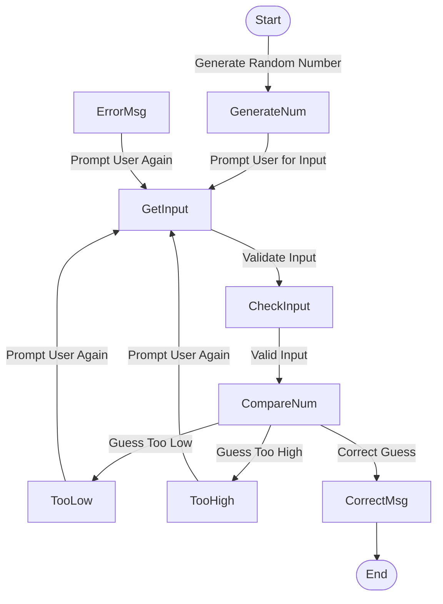

# Jhayes0314.guessing.md

Guessing Game

## Description
1. **Start** - The game begins.
2. **Generate Random Number** - The system generates a random number within a defined range.
3. **Prompt User for Input** - The user is asked to enter a guess.
4. **Validate Input** - The system checks whether the input is a valid number.
   - If invalid (non-numeric input), an error message is displayed, and the user is prompted again.
5. **Compare Number** - The system compares the user's guess with the generated number.
   - If the guess is too low, the user is prompted again.
   - If the guess is too high, the user is prompted again.
   - If the guess is correct, a success message is displayed, and the game ends.
